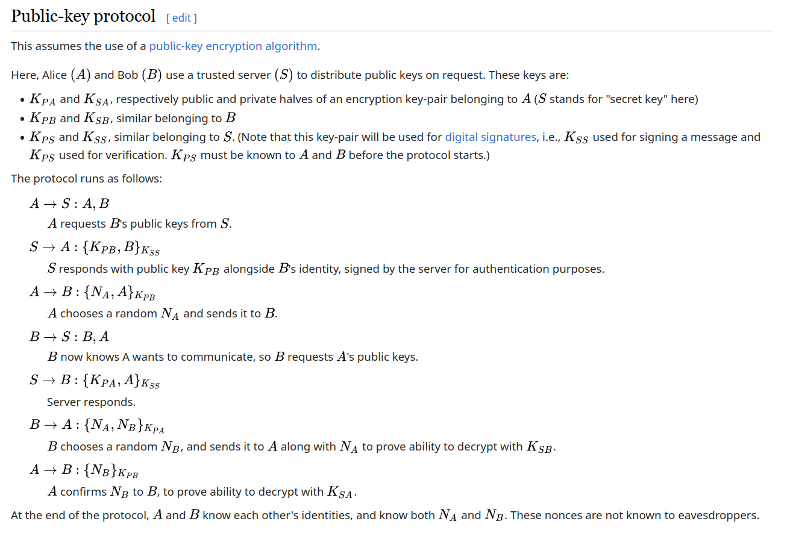

# Crypto_Project
## Project Overview
Cryptography course project requiring to implement KDC (Key Distribution Center) that 
allows two users to share safely a Ceaser key index.
KDC should rely on self written RSA implementation.
### Purpose
The purpose is to improve and strengthen the knowledge obtained during classes 
by implementing `Needham-Schroeder` Protocol, `Asymmetric` and `Symmetric` algorithms.
### Team
- Nazim Ganizada
- Ismayil Guliyev


## Details
### Needham-Schroeder Protocol
Our implementation is same as in wikipedia with a slight change, at last stage where `A` proves to `B` ability to decrypt with `Ksa` `A` generates and send `Ceaser` key for further communication.  

Interaction between clients provided by `WebSocket` in json format containing custom fields `method`, `payload` and `dest` for handling protocol flow.
Only payload is encrypted during transfer. Source code of implementation id in `src/client/static/board.js`

### RSA
Source code is in `src/core/tools` directory
#### Implementation overview
The implementation consists of a Python module containing `RSA` class with methods for key generation, encryption, and decryption, as well as static methods for encryption and decryption with custom keys. The module also imports functions from a separate MathTools module for prime number generation and modular arithmetic operations.

## Tech stack
- FastAPI: backend
- WebSockets: for full-duplex connection between clients
- Pyodide: executing python code inside of browser(as the RSA was implemented in python, there was need to use it in browser without writing new implementation in JS)
- Jinja2: templating for front end.
- Poetry: dependency management

## Running Project
For first time run:
```bash
SECRET_KEY=$(openssl rand -hex 20 | cut -c -32) && echo "SECRET_KEY=$SECRET_KEY" >> .env
```

```bash
poetry install
```

Running project:
```bash
poetry shell
python manage.py run
```

 
## References
- “Needham–Schroeder Protocol.” Wikipedia, 20 Mar. 2024. Wikipedia, https://en.wikipedia.org/w/index.php?title=Needham%E2%80%93Schroeder_protocol&oldid=1214650104.
- RSA from scratch, https://coderoasis.com/implementing-rsa-from-scratch-in-python/